<h1 align="center">Привет, я Владимир Сметана 👋</h1>
<h3 align="center">C++ / Python Developer & Системный инженер</h3>

  
  
  
  

---
<table>
<tr>
<td valign="middle" width="40%">
  
</td>
<td valign="top" width="60%">

### 💻 Обо мне

Я специализируюсь на низкоуровневой и серверной разработке, создании автоматизаций и работе с открытым исходным кодом. Интересуюсь внутренним устройством браузеров и системным программированием.

- 🛠️ Разрабатываю высокопроизводительные приложения на **C++** и эффективные скрипты на **Python**.
- 🐧 Уверенно чувствую себя в окружении **Linux** и пишу автоматизации на **Bash**.
- 🔍 Имею опыт работы с кодовой базой **Chromium** и сопутствующими инструментами автоматизации.
- 🌐 Применяю **Java**, **JavaScript** и **SQL** для решения смежных и инфраструктурных задач.

</td>
</tr>
</table>

---
### 🛠️ Стек технологий

<table>
<tr>
<td valign="top" width="60%">

#### Языки программирования & Базы данных

  
  
  
  
  
  
  

#### Окружение, Инструменты & Браузерные технологии

  
  
  
  
  
  
  

</td>
<td valign="top" width="40%">

#### 📊 Most Used Languages

  

</td>
</tr>
</table>
